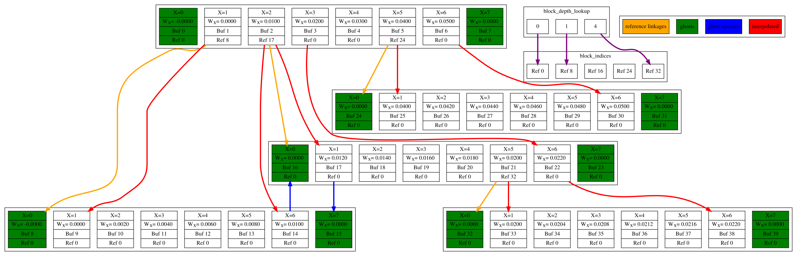

# -----~/^-^/------->

Nyion. An ion optics program - made of Nyan cat.

Because electrons are so fast compared to ions, to resolve both over long durations without resorting to slow-electron simulations like Vsim, Particle in Cell / DSMC sims must solve grids very rapidly and efficiently. 
At least for simple relaxation-based solvers (not BiCGSTAB, for instance), the main limitation on performance seems to be the data structure used to represent the physical mesh.

This is a test implementation of a very fast (something like 19 ms per mesh) block structured mesh data structure. This might now be superseded by WarpX / AMReX. This runs entirely on the GPU memory via CUDA. The field solver is very basic: a Jacobi relaxer on multigrid (not EM, just Poisson).

This specific form of the block-structured mesh data structure seems to be pretty cool for geometric multigrid electrostatic solvers, because the hierarchical geometry of the mesh corresponds well to multigrid requirements.
 Depth- and breadth- traversals are easy to code; ghost cells can be handled separately; and updates "at the edges" of a block are handled seamlessly.

Ultimately, a little more knowledge of Vlasov equations or even basic linear algebra would probably have been better than spending time on this, but there you go.

