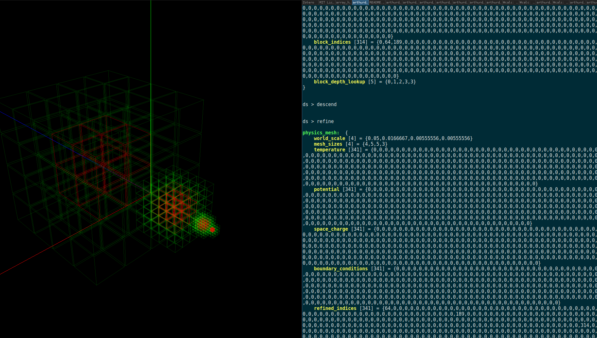
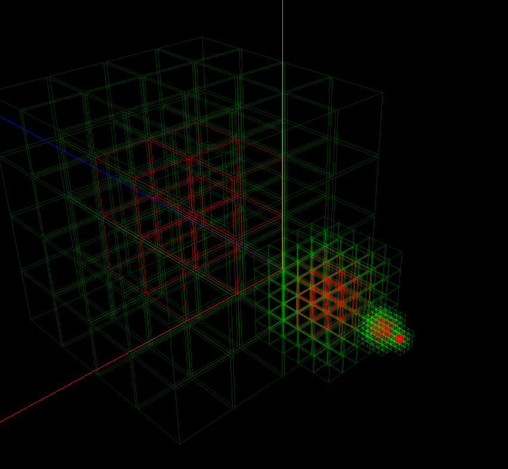

# -----~/^-^/-------> 

##### todo: maybe split out the data structure as a seperate library?

This is a block-structured mesh ion optics program - made of pure Nyan cat.

Because, given the same energy, electrons super fast compared to ions, to resolve both over long durations without resorting to slow-electron simulations (like [Vsim]), Particle in Cell / DSMC sims must solve grids very rapidly and efficiently. 
At least for simple relaxation-based solvers (not BiCGSTAB, for instance), the main limitation on performance seems to be the node-efficiency of the data structure used to represent the physical mesh.

```
[Vsim] Werner GR, Jenkins TG, Chap AM, Cary JR. Speeding Up Simulations By Slowing Down Particles: Speed-Limited Particle-In-Cell Simulation. ArXiv:151108225 [Physics] 2019.
```

This whole thing might now be superseded by WarpX / AMReX. 

This is a test implementation of a very fast (something like 19 ms per mesh) block structured mesh data structure. This runs entirely on the GPU memory via CUDA. The finite-difference field solver is very basic: a Jacobi relaxer on multigrid (not EM, just Poisson).

This specific form of block-structured mesh data structure seems to be pretty cool for geometric multigrid electrostatic solvers, because the hierarchical geometry of the mesh corresponds well to multigrid requirements.
 Depth- and breadth- traversals are easy to code; ghost cells can be handled separately; and updates "at the edges" of a block are handled seamlessly, and "world-space" unit structure is preserved.


Ultimately, a little more knowledge of Vlasov equations or even basic linear algebra would probably have been better than spending time on this, but there you go.

One thing that might be generally helpful: coding "mesh stencils" (and other operations) on complex data-structures in low-level code is pretty tricky to get right, and it's hard to write tests for array indexes you can't visually see. To help with this, there's a little TUI and OpenGL tool that helps visualize array indices.




I guess the proper solution would be to write some sort of high-level array coding language.


For an introduction to the multigrid methods used here, I highly recommend the book
```
Briggs WL, McCormick SF, others. A multigrid tutorial. Siam; 2000.
```

For all references, see the file references.bib in the associated ion_printer repo.

There are also a few tests of GCC's new GPU offloading (no significant benefit for these problem sizes).

# <3     

# :D
